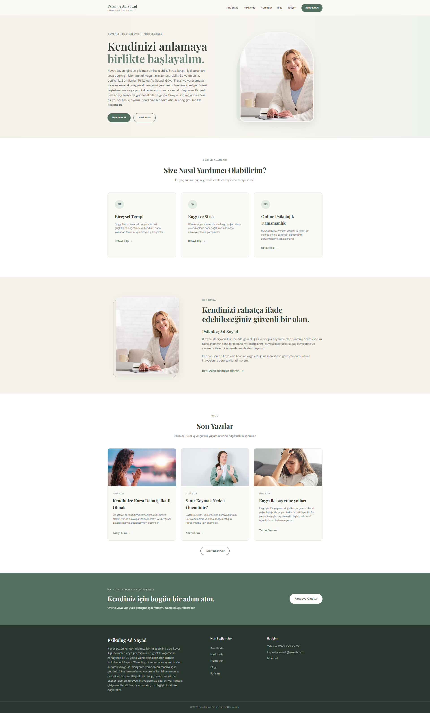
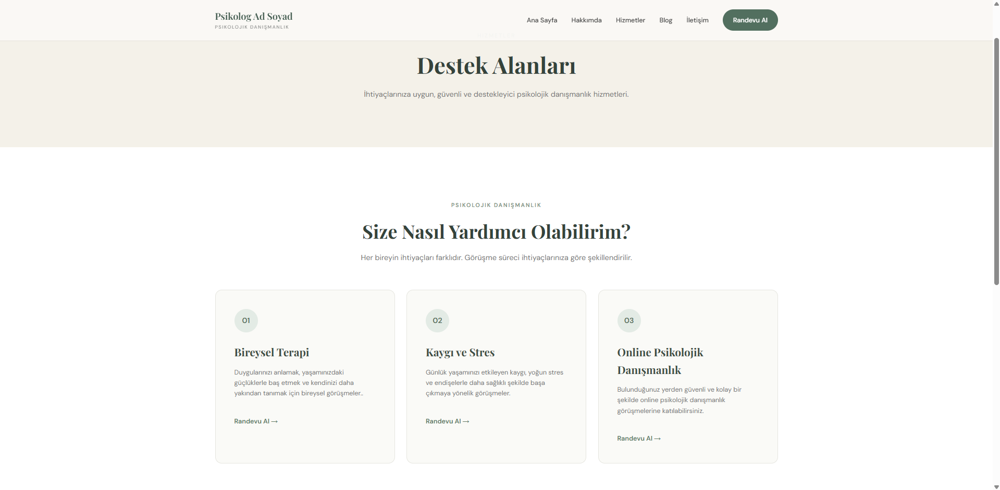
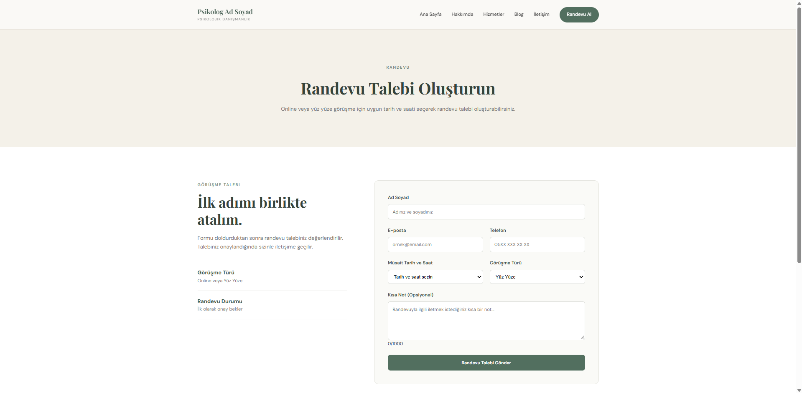
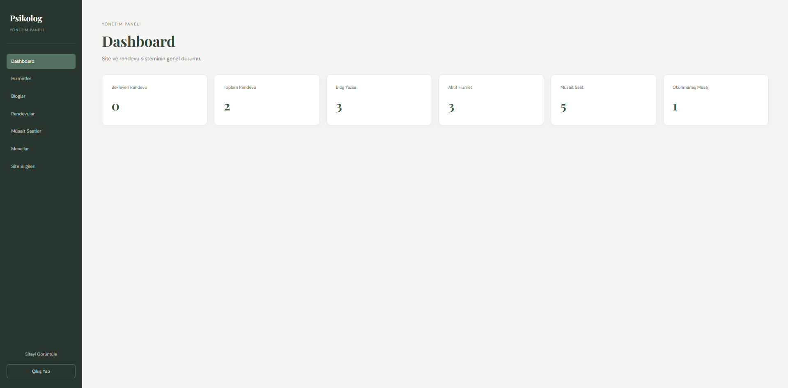
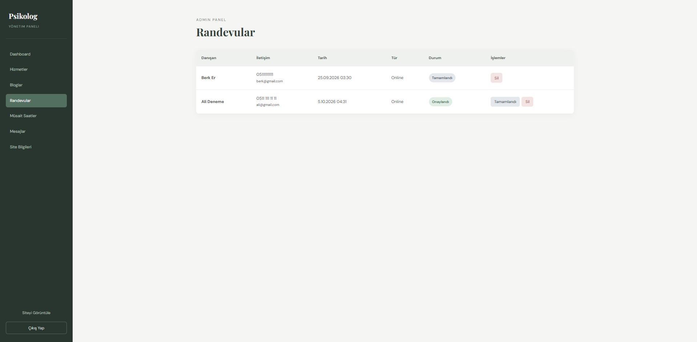

# PsychologistWeb

**Kullanılan Teknolojiler:**  
`React` • `Vite` • `JavaScript` • `ASP.NET Core Web API` • `C#` • `Entity Framework Core` • `SQL Server` • `JWT` • `MailKit`

PsychologistWeb, psikologlar için geliştirilmiş full-stack bir web uygulamasıdır.

Projede ziyaretçilerin hizmetleri inceleyebileceği, blog yazılarını okuyabileceği, iletişim formu gönderebileceği ve müsait saatlerden randevu talebi oluşturabileceği bir web sitesi bulunmaktadır.

Site sahibinin içerikleri ve randevuları yönetebilmesi için ayrıca özel bir admin paneli geliştirilmiştir.

## Özellikler

### Kullanıcı Tarafı

- Ana sayfa
- Hakkımda sayfası
- Hizmetler
- Blog ve blog detay sayfaları
- Müsait saatlerden randevu talebi oluşturma
- İletişim formu
- Mobil uyumlu tasarım
- 404 sayfası

### Admin Paneli

- Güvenli admin girişi
- Hizmet ekleme, düzenleme ve silme
- Blog yönetimi
- Randevu yönetimi
- Müsait saat yönetimi
- İletişim mesajlarını görüntüleme
- Site bilgilerinin düzenlenmesi
- Profil fotoğrafı yükleme
- Şifre sıfırlama

## Güvenlik

Projede temel güvenlik önlemleri uygulanmıştır:

- JWT ile kimlik doğrulama
- Rol bazlı yetkilendirme
- Şifrelerin hashlenerek saklanması
- Tek kullanımlık şifre sıfırlama tokenları
- Rate limiting
- Frontend ve backend validation
- Gizli bilgilerin .NET User Secrets ile saklanması

## Proje Yapısı

```text
PsychologistWeb
│
├── PsychologistWeb.Api
│   ├── Controllers
│   ├── DTOs
│   ├── Models
│   ├── Data
│   ├── Services
│   └── Migrations
│
└── psychologist-web-client
    └── src
        ├── admin
        ├── components
        ├── pages
        ├── context
        └── services
```

## Kurulum

Projeyi klonlayın:

```bash
git clone https://github.com/Kaandalgar/PsychologistWeb.git
cd PsychologistWeb
```

### Backend

```bash
cd PsychologistWeb.Api
dotnet restore
dotnet ef database update
dotnet run --urls "http://localhost:5165"
```

### Frontend

Yeni bir terminal açın:

```bash
cd psychologist-web-client
npm install
npm run dev
```

Frontend varsayılan olarak:

```text
http://localhost:5173
```

adresinde çalışır.

## Frontend API Ayarı

`psychologist-web-client/.env.development` dosyasında:

```env
VITE_API_URL=http://localhost:5165/api
```

kullanılabilir.

JWT anahtarı, SMTP şifresi ve benzeri gizli bilgiler kaynak kodunda tutulmamaktadır.

## Ekran Görüntüleri


### 1. Ana Sayfa



### 2. Hizmetler



### 3. Randevu Sayfası



### 4. Admin Dashboard



### 5. Admin Randevu Yönetimi



## Geliştirici

**Kaan Dalgar**

GitHub: https://github.com/Kaandalgar
